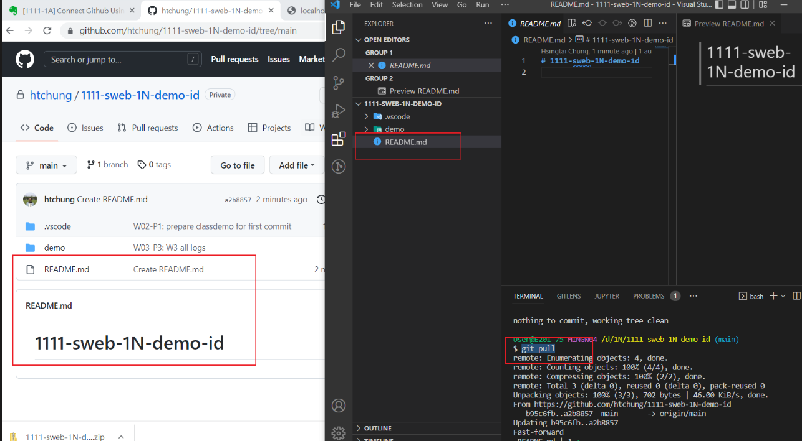
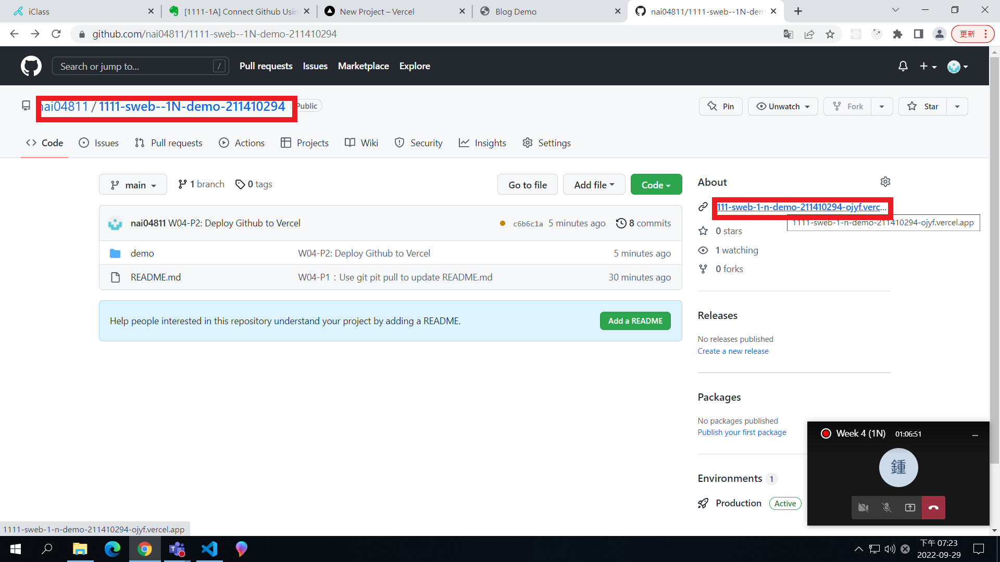
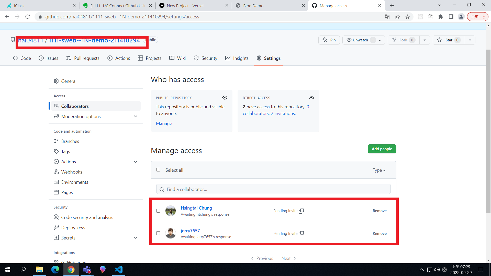
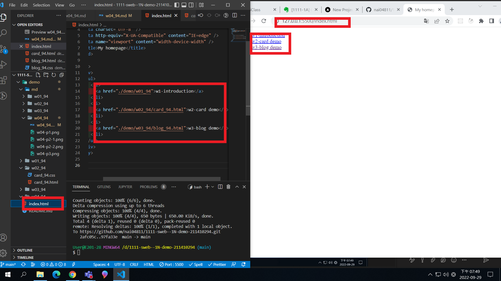
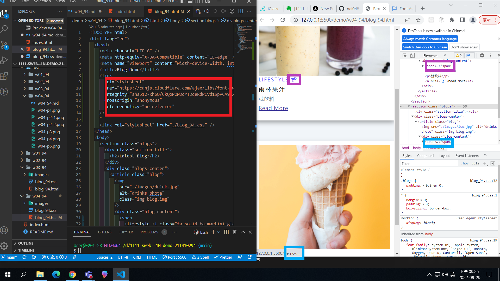

### Github repo url

[My Github repo](https://github.com/nai04811/1111-sweb--1N-demo-211410294)

### W04-P1：Use git pit pull to update README.md

### W04-P2: Deploy Github to Vercel

### W04-P3: Share Github repo to teacher and TA

### W04-P4: add index.html as homepage, and show in Vercel

### W04-P5: finish w03 blog demo with hover and transition

### W04-P6: Add font awesome css, add two icons

